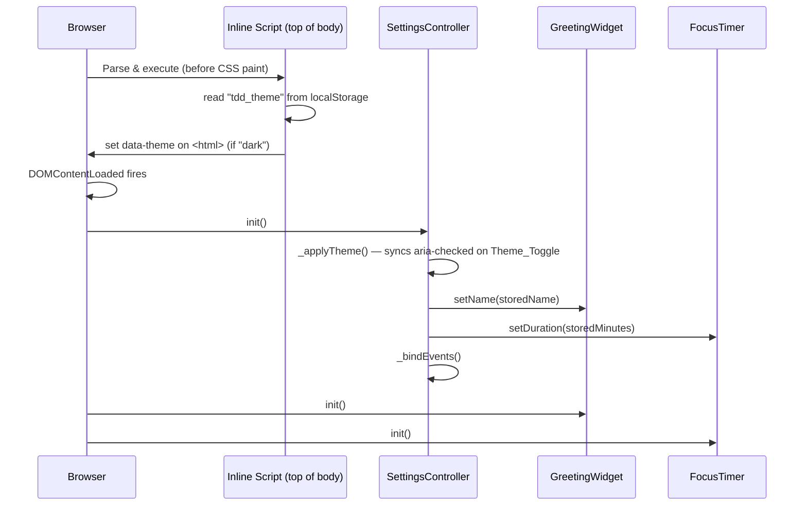

# Design Document — Dashboard Settings

## Overview

The Dashboard Settings feature adds a **Settings Panel** to the existing To-Do List Dashboard, exposing three user-configurable preferences: light/dark colour scheme, a personalised greeting name, and a configurable Pomodoro (focus timer) duration. All three settings persist across sessions via the existing `StorageService` (`localStorage` wrapper).

The implementation stays within the project's constraints: **vanilla HTML/CSS/JavaScript**, no build tools, no frameworks, no npm. A new `SettingsController` module is added to `js/main.js` alongside the existing `GreetingWidget`, `FocusTimer`, `TodoList`, and `QuickLinks` modules.

Key design decisions:

- **Theme is applied before first paint** using an inline `<script>` at the top of `<body>`, preventing a flash of unstyled content (FOUC).
- **Dark mode is CSS-only** — `[data-theme="dark"]` on `<html>` overrides the `:root` custom properties. No colour values are changed by JavaScript.
- **Settings Panel is an `<aside>`** with `role="dialog"` that slides in as an overlay sidebar, toggled by a button in the page header.
- **Module coupling is minimal** — `SettingsController` calls narrow setter APIs (`GreetingWidget.setName`, `FocusTimer.setDuration`) so existing modules require only small, backward-compatible additions.

---

## Architecture

```mermaid
flowchart TD
    subgraph HTML ["index.html"]
        INLINE["Inline theme script\n(top of body)"]
        HEADER["<header>\n  Settings_Toggle btn"]
        ASIDE["<aside id='settings-panel'>\n  Theme toggle\n  Name input\n  Duration input"]
        WIDGETS["Dashboard widgets"]
    end

    subgraph JS ["js/main.js"]
        SC["SettingsController\n  init()\n  _applyTheme()\n  _applyName()\n  _applyDuration()\n  _handleThemeToggle()\n  _handleNameSubmit()\n  _handleDurationSubmit()\n  _openPanel()\n  _closePanel()"]
        GW["GreetingWidget\n  getGreeting(hour, name?)\n  setName(name)\n  render(now)"]
        FT["FocusTimer\n  setDuration(minutes)\n  _durationMinutes\n  reset()"]
        SS["StorageService\n  read(key)\n  write(key, value)"]
    end

    INLINE -->|reads localStorage tdd_theme| SS
    INLINE -->|sets data-theme on html| HTML

    SC -->|reads/writes| SS
    SC -->|calls setName()| GW
    SC -->|calls setDuration()| FT

    HEADER -->|click| SC
    ASIDE -->|change events| SC

    GW -->|renders| WIDGETS
    FT -->|renders| WIDGETS
```

### Initialization Sequence



---

## Components and Interfaces

### 1. `SettingsController` (new module)

```javascript
var SettingsController = {
  // Public API
  init: function () { /* reads storage, applies all settings, binds events */ },

  // Private helpers
  _applyTheme:          function (theme) { /* sets/removes data-theme on <html> */ },
  _applyName:           function (name)  { /* calls GreetingWidget.setName()   */ },
  _applyDuration:       function (mins)  { /* calls FocusTimer.setDuration()   */ },
  _handleThemeToggle:   function ()      { /* flips theme, persists, updates UI */ },
  _handleNameSubmit:    function ()      { /* validates, trims, persists name   */ },
  _handleDurationSubmit:function ()      { /* validates range, persists minutes */ },
  _openPanel:           function ()      { /* shows aside, updates aria-label   */ },
  _closePanel:          function ()      { /* hides aside, returns focus        */ },
};
```

**Storage keys used:**

| Key | Type | Valid values |
|-----|------|--------------|
| `tdd_theme` | string | `"light"` \| `"dark"` |
| `tdd_user_name` | string | any trimmed non-empty string, max 50 chars |
| `tdd_pomodoro_minutes` | string (serialised integer) | `"1"` – `"120"` |

### 2. `GreetingWidget` — modified interface

```javascript
// BEFORE (existing)
getGreeting: function (hour) { ... }

// AFTER — name parameter is optional; existing callers unaffected
getGreeting: function (hour, name) {
  // returns "Good Morning" when name is absent/empty
  // returns "Good Morning, Alex" when name is provided
}

// NEW method — called by SettingsController
setName: function (name) {
  this._name = name || '';
  this.render(new Date());
}
```

`GreetingWidget.render(now)` is updated to call `this.getGreeting(hour, this._name)`.

### 3. `FocusTimer` — modified interface

```javascript
// NEW field replacing the hard-coded 1500
_durationMinutes: 25,   // configurable; used by reset()

// reset() updated to use _durationMinutes
reset: function () {
  this.stop();
  this._state = {
    totalSeconds: this._durationMinutes * 60,
    running: false,
    complete: false
  };
  this.render();
},

// NEW method — called by SettingsController
setDuration: function (minutes) {
  this._durationMinutes = minutes;
  this.stop();
  this._state = {
    totalSeconds: minutes * 60,
    running: false,
    complete: false
  };
  this.render();
}
```

### 4. Inline theme script

A small, synchronous `<script>` block placed immediately after `<body>` opens (before any CSS renders) reads `localStorage` and applies `data-theme` to prevent FOUC:

```html
<script>
  (function () {
    try {
      var t = localStorage.getItem('tdd_theme');
      if (t === 'dark') document.documentElement.setAttribute('data-theme', 'dark');
    } catch (e) { /* silent fallback — light theme remains */ }
  })();
</script>
```

---

## Data Models

### Settings Object (in-memory, not persisted as a blob)

Settings are stored individually under their own keys rather than as a single JSON object. This makes each setting independently readable and writable without deserializing the whole settings object.

```
StorageService key schema:

  "tdd_theme"             → "light" | "dark"
  "tdd_user_name"         → string (trimmed, 1–50 chars) | absent/null
  "tdd_pomodoro_minutes"  → integer string "1"–"120" | absent/null
```

### GreetingWidget internal state addition

```javascript
_name: ''   // string — empty string means no personalised name
```

### FocusTimer internal state addition

```javascript
_durationMinutes: 25   // number — replaces the hard-coded 1500 in reset()
```

---

## HTML Structure — Settings Panel

```html
<!-- Placed immediately after <body> opens -->
<script>/* inline theme FOUC-prevention script */</script>

<!-- Header bar — new element wrapping existing content -->
<header class="dashboard-header">
  <span class="dashboard-header__title">Dashboard</span>
  <button
    id="settings-toggle"
    type="button"
    class="settings-toggle"
    aria-label="Open settings"
    aria-controls="settings-panel"
    aria-expanded="false"
  >⚙</button>
</header>

<!-- Settings panel — aside overlay -->
<aside
  id="settings-panel"
  class="settings-panel"
  role="dialog"
  aria-label="Dashboard settings"
  aria-modal="true"
  hidden
>
  <div class="settings-panel__header">
    <h2 class="settings-panel__title">Settings</h2>
    <button
      id="settings-close"
      type="button"
      class="settings-panel__close"
      aria-label="Close settings"
    >✕</button>
  </div>

  <!-- Theme toggle -->
  <div class="settings-panel__row">
    <label id="label-theme" class="settings-panel__label">Dark mode</label>
    <button
      id="theme-toggle"
      type="button"
      role="switch"
      aria-checked="false"
      aria-labelledby="label-theme"
      class="settings-toggle-switch"
    >
      <span class="settings-toggle-switch__thumb"></span>
    </button>
  </div>

  <!-- Greeting name -->
  <div class="settings-panel__row settings-panel__row--column">
    <label for="settings-name-input" class="settings-panel__label">Your name</label>
    <input
      id="settings-name-input"
      type="text"
      maxlength="50"
      autocomplete="given-name"
      placeholder="e.g. Alex"
      class="settings-panel__input"
    />
    <button id="settings-name-save" type="button" class="settings-panel__save-btn">Save</button>
    <p id="settings-name-error" class="error-msg" hidden></p>
  </div>

  <!-- Pomodoro duration -->
  <div class="settings-panel__row settings-panel__row--column">
    <label for="settings-duration-input" class="settings-panel__label">
      Focus duration (minutes)
    </label>
    <input
      id="settings-duration-input"
      type="number"
      min="1"
      max="120"
      step="1"
      value="25"
      class="settings-panel__input settings-panel__input--narrow"
    />
    <button id="settings-duration-save" type="button" class="settings-panel__save-btn">Save</button>
    <p id="settings-duration-error" class="error-msg" hidden></p>
  </div>
</aside>

<!-- Existing <main class="dashboard-grid"> follows -->
```

---

## CSS Approach — Dark Mode Tokens

Dark mode is implemented entirely in CSS using `[data-theme="dark"]` attribute overrides on `:root` custom properties. No JavaScript writes any colour values.

```css
/* css/style.css additions */

/* ─────────────────────────────────────────────────
   DARK THEME TOKEN OVERRIDES
───────────────────────────────────────────────── */
[data-theme="dark"] {
  --color-bg:        #1a1a1a;
  --color-surface:   #2c2c2c;
  --color-primary:   #6ab07a;
  --color-danger:    #e05c4b;
  --color-text:      #e8e8e8;
  --color-muted:     #999999;
  --color-border:    #444444;
  --color-done-text: #666666;
}

/* ─────────────────────────────────────────────────
   SETTINGS HEADER
───────────────────────────────────────────────── */
.dashboard-header {
  display: flex;
  align-items: center;
  justify-content: space-between;
  padding: var(--space-md) var(--space-lg);
  background: var(--color-surface);
  border-bottom: 1px solid var(--color-border);
}

.dashboard-header__title {
  font-size: var(--fs-lg);
  font-weight: 700;
  color: var(--color-primary);
}

.settings-toggle {
  background: transparent;
  border: 1px solid var(--color-border);
  color: var(--color-text);
  font-size: var(--fs-lg);
  width: 2.5rem;
  height: 2.5rem;
  border-radius: var(--radius-sm);
  cursor: pointer;
  display: flex;
  align-items: center;
  justify-content: center;
}

/* ─────────────────────────────────────────────────
   SETTINGS PANEL (ASIDE OVERLAY)
───────────────────────────────────────────────── */
.settings-panel {
  position: fixed;
  top: 0;
  right: 0;
  height: 100%;
  width: min(360px, 100vw);
  background: var(--color-surface);
  border-left: 1px solid var(--color-border);
  box-shadow: -4px 0 16px rgba(0, 0, 0, 0.15);
  padding: var(--space-lg);
  display: flex;
  flex-direction: column;
  gap: var(--space-lg);
  z-index: 100;
  overflow-y: auto;
}

.settings-panel[hidden] {
  display: none;
}

.settings-panel__header {
  display: flex;
  align-items: center;
  justify-content: space-between;
}

.settings-panel__title {
  font-size: var(--fs-lg);
  font-weight: 600;
  color: var(--color-text);
}

.settings-panel__row {
  display: flex;
  align-items: center;
  justify-content: space-between;
  gap: var(--space-sm);
}

.settings-panel__row--column {
  flex-direction: column;
  align-items: flex-start;
}

.settings-panel__label {
  font-size: var(--fs-base);
  color: var(--color-text);
  font-weight: 500;
}

.settings-panel__input {
  width: 100%;
}

.settings-panel__input--narrow {
  width: 6rem;
}

/* Toggle switch control */
.settings-toggle-switch {
  position: relative;
  width: 3rem;
  height: 1.5rem;
  background: var(--color-border);
  border: none;
  border-radius: 999px;
  cursor: pointer;
  padding: 0;
  transition: background 0.2s ease;
  flex-shrink: 0;
}

.settings-toggle-switch[aria-checked="true"] {
  background: var(--color-primary);
}

.settings-toggle-switch__thumb {
  position: absolute;
  top: 0.125rem;
  left: 0.125rem;
  width: 1.25rem;
  height: 1.25rem;
  background: var(--color-surface);
  border-radius: 50%;
  transition: transform 0.2s ease;
  pointer-events: none;
}

.settings-toggle-switch[aria-checked="true"] .settings-toggle-switch__thumb {
  transform: translateX(1.5rem);
}
```

---

## Correctness Properties

*A property is a characteristic or behavior that should hold true across all valid executions of a system — essentially, a formal statement about what the system should do. Properties serve as the bridge between human-readable specifications and machine-verifiable correctness guarantees.*

### Property 1: Greeting format with name

*For any* hour value in [0, 23] and any non-empty, non-whitespace string as a name, `GreetingWidget.getGreeting(hour, name)` must equal `GreetingWidget.getGreeting(hour) + ", " + name`.

**Validates: Requirements 3.3**

---

### Property 2: Whitespace-only names are rejected

*For any* string composed entirely of whitespace characters (spaces, tabs, newlines), submitting it as the user name must result in the stored `tdd_user_name` key being absent (or null) and `GreetingWidget._name` being the empty string.

**Validates: Requirements 3.5**

---

### Property 3: Name trim invariant

*For any* non-empty string with arbitrary leading and trailing whitespace, the value stored under `tdd_user_name` and passed to `GreetingWidget.setName()` must equal the trimmed (`.trim()`) version of the input — never the raw padded string.

**Validates: Requirements 3.2**

---

### Property 4: FocusTimer duration-seconds invariant

*For any* integer `n` where `1 ≤ n ≤ 120`, calling `FocusTimer.setDuration(n)` must result in `FocusTimer._state.totalSeconds === n * 60` and `FocusTimer._state.running === false` immediately after the call.

**Validates: Requirements 4.2, 4.3**

---

### Property 5: Invalid duration leaves state unchanged

*For any* value `v` that is either not a whole number or falls outside the range [1, 120] (e.g. 0, 121, 1.5, NaN, negative numbers), submitting `v` as a Pomodoro duration must leave `FocusTimer._state.totalSeconds` and `StorageService` key `tdd_pomodoro_minutes` unchanged.

**Validates: Requirements 4.4**

---

### Property 6: Settings storage round-trip

*For any* valid settings triple — a theme value in `{"light", "dark"}`, a name string (1–50 chars), and a duration integer in [1, 120] — writing each to `StorageService` under their respective keys and then reading them back must return values that equal the written values.

**Validates: Requirements 5.3**

---

### Property 7: Settings panel aria-label reflects open/closed state

*For any* sequence of toggle activations, the `aria-label` attribute on the Settings_Toggle button must always equal `"Close settings"` when the panel is visible and `"Open settings"` when it is hidden.

**Validates: Requirements 1.5**

---

### Property 8: Theme toggle round-trip

*For any* starting theme state (`"light"` or `"dark"`), activating the Theme_Toggle twice in succession must leave both the `data-theme` attribute on `<html>` and the value stored under `tdd_theme` identical to their values before the two activations (round-trip / involution property).

**Validates: Requirements 2.2, 2.3**

---

### Property 9: Settings panel inputs reflect stored values after init

*For any* valid combination of stored settings (`tdd_theme`, `tdd_user_name`, `tdd_pomodoro_minutes`), calling `SettingsController.init()` must result in the Settings_Panel input controls displaying values that match the stored values: the theme toggle `aria-checked` matches the theme, the name input value equals the stored name, and the duration input value equals the stored duration.

**Validates: Requirements 5.4**

---

## Error Handling

| Scenario | Behaviour |
|----------|-----------|
| `StorageService.read` fails for any settings key | Silent fallback to default (light theme, no name, 25-min timer); no error shown to user |
| `StorageService.write("tdd_theme")` fails | DOM `data-theme` change is kept; inline error message shown in Settings_Panel |
| `StorageService.write("tdd_user_name")` fails | `GreetingWidget._name` update is kept; inline error message shown in Settings_Panel |
| `StorageService.write("tdd_pomodoro_minutes")` fails | `FocusTimer.setDuration()` call is kept; inline error message shown in Settings_Panel |
| Duration input value is out of range or non-integer | Inline validation error shown; `FocusTimer` and `StorageService` not updated |
| Name input is empty or whitespace-only on submit | Stored key is removed, greeting reverts to nameless format; no error shown |
| Inline theme script throws (e.g. cookies blocked) | `try/catch` swallows error; light theme renders (no `data-theme` attribute) |

Error messages are displayed in the existing `.error-msg` style, rendered inside the Settings_Panel. All error elements follow the existing `hidden` attribute pattern (`showElement` / `hideElement` helpers).

---

## Testing Strategy

### Unit Tests (example-based, `test/*.test.js`)

Focus on concrete inputs and specific edge cases.

| Test file | What to cover |
|-----------|---------------|
| `test/greeting.test.js` | `getGreeting(hour, name)` with name; `getGreeting(hour)` without name (backward compat); edge hours (0, 4, 5, 11, 12, 17, 18, 23) |
| `test/timer.test.js` | `setDuration(n)` sets `_state.totalSeconds = n * 60`; `reset()` uses `_durationMinutes`; `setDuration` stops running timer |
| `test/settings.test.js` *(new)* | SettingsController init with all three keys present; init with no keys; write failure → error shown, DOM unchanged; duplicate key scenarios; panel open/close state |

### Property-Based Tests (`test/settings.test.js`)

The project uses plain JavaScript tests run in the browser (`test/index.html`). Property-based testing will be implemented using [**fast-check**](https://fast-check.dev/) loaded via CDN (no npm required). Each property is run with a minimum of **100 iterations**.

Tag format: `// Feature: dashboard-settings, Property N: <property text>`

| Property | Generator | What is checked |
|----------|-----------|-----------------|
| **P1** Greeting format with name | `fc.integer({min:0,max:23})`, `fc.string({minLength:1}).filter(s => s.trim().length > 0)` | `getGreeting(h, n) === getGreeting(h) + ", " + n` |
| **P2** Whitespace names rejected | `fc.string().map(s => s.replace(/\S/g, ' '))` (all-whitespace strings) | `_name === ''`, storage key absent after submit |
| **P3** Name trim invariant | `fc.string({minLength:1})` wrapped with random whitespace padding | stored value === `input.trim()` |
| **P4** FocusTimer duration-seconds invariant | `fc.integer({min:1, max:120})` | `_state.totalSeconds === n * 60`, `_state.running === false` |
| **P5** Invalid duration leaves state unchanged | `fc.oneof(fc.integer().filter(n => n < 1 || n > 120), fc.float().filter(n => !Number.isInteger(n)), fc.constant(NaN))` | state and storage unchanged |
| **P6** Settings storage round-trip | `fc.constantFrom('light','dark')`, `fc.string({minLength:1, maxLength:50})`, `fc.integer({min:1,max:120})` | read-after-write returns same value |
| **P7** aria-label reflects panel state | `fc.array(fc.boolean())` (sequence of toggle activations) | invariant holds after each activation |
| **P8** Theme toggle round-trip | `fc.constantFrom('light','dark')` | two toggles returns to original state |
| **P9** Panel inputs reflect stored values | `fc.record({theme: fc.constantFrom('light','dark'), name: fc.string({minLength:1,maxLength:50}), duration: fc.integer({min:1,max:120})})` | all three inputs display correct values after init |

**Unit test balance**: Property tests cover universal correctness; example-based unit tests cover error paths (storage failures), specific DOM attribute checks (role, aria-label values, input attributes), and integration between modules. Avoid writing example tests for cases already covered by the property generators.
