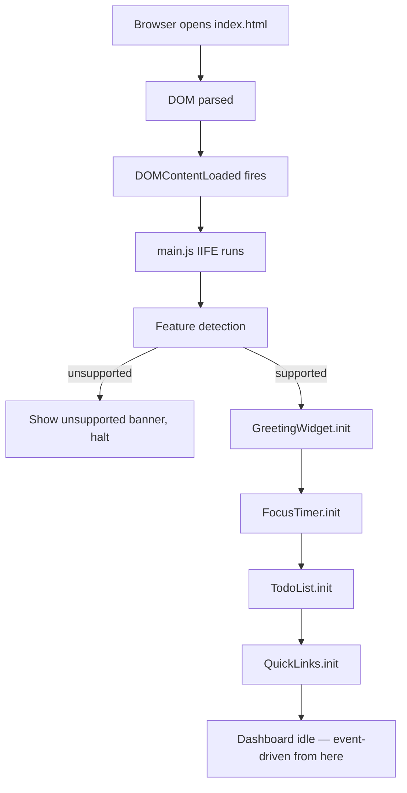
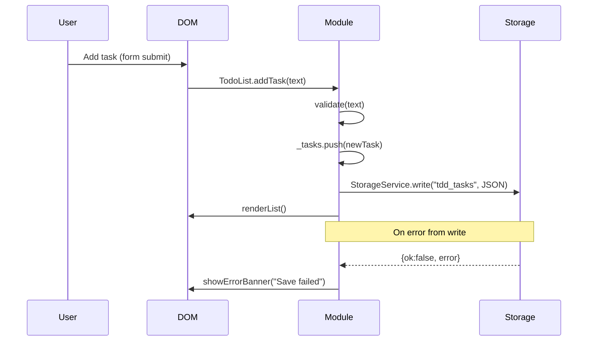
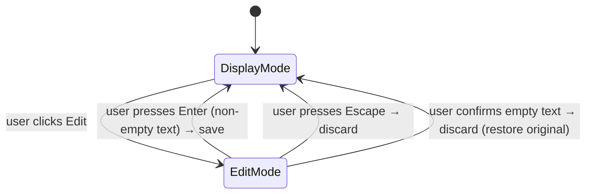

# Design Document — To Do List Dashboard

## Overview

The To Do List Dashboard is a zero-dependency, client-side productivity application delivered as three plain files: `index.html`, `css/style.css`, and `js/main.js`. No framework, no build step, no server. The page opens directly from the file system (`file://` protocol) and persists all user data using the browser's `localStorage` API.

The UI is a single-page dashboard with four independent widgets arranged in a responsive grid:

| Widget | Primary Concern |
|---|---|
| Greeting | Read-only time/date display with periodic refresh |
| Focus Timer | Stateful 25-minute countdown (Pomodoro) |
| To-Do List | CRUD task manager with persistence |
| Quick Links | CRUD link manager with persistence |

All widgets are rendered on initial load and updated in place; there are no page navigations or server round-trips.

---

## Architecture

### High-Level Structure

```
index.html          — markup skeleton, widget containers, script/style references
css/style.css       — all visual rules, CSS custom properties (tokens), responsive layout
js/main.js          — all application logic, executed after DOMContentLoaded
```

`main.js` is an IIFE (Immediately Invoked Function Expression) to avoid polluting the global scope. Inside it, each widget is implemented as a plain-object module with `init()`, state, and internal helpers. There is no module bundler; everything shares the same closure.

### Execution Flow



### Inter-Widget Communication

Widgets are fully independent. No widget reads another widget's state. Communication with the outside world is limited to:

- `localStorage` (read on init, write on mutation)
- `setInterval` / `clearInterval` (Greeting clock tick, Timer countdown tick)
- DOM events (user input, button clicks, keyboard)

---

## Components and Interfaces

### Feature Detection Module

Runs before any widget initialises. Checks for `localStorage` and `setInterval` availability. If either is absent, renders a full-page unsupported banner and halts further initialisation.

```
featureDetect()
  returns { ok: boolean, missing: string[] }
```

### GreetingWidget

**Responsibility:** Display date, time, and greeting; refresh every 60 s.

```
GreetingWidget
  .init(containerEl)          — render once, start tick interval
  .render(now: Date)          — update DOM from a Date value
  .getGreeting(hour: number)  — pure fn: hour → greeting string
  .formatDate(now: Date)      — pure fn: Date → "Weekday, Month D, YYYY"
  .formatTime(now: Date)      — pure fn: Date → "HH:MM"
  ._interval                  — handle returned by setInterval
```

### FocusTimer

**Responsibility:** Manage a 25-minute countdown with Start/Stop/Reset controls.

```
FocusTimer
  .init(containerEl)
  .start()                    — begin countdown (no-op if already running)
  .stop()                     — pause countdown
  .reset()                    — stop and restore to 1500 s
  .render()                   — update display from internal state
  ._state: {
      totalSeconds: number    — seconds remaining (0–1500)
      running: boolean
      complete: boolean
  }
  ._interval                  — setInterval handle
  ._tick()                    — decrement, check completion, call render
```

### TodoList

**Responsibility:** CRUD operations on tasks, localStorage persistence, inline editing.

```
TodoList
  .init(containerEl)
  .loadFromStorage()          — read + parse localStorage, set _tasks
  .saveToStorage()            — JSON.stringify _tasks → localStorage
  .addTask(text: string)      — validate, push, persist, re-render
  .editTask(id: string, newText: string)
  .toggleTask(id: string)
  .deleteTask(id: string)
  .renderList()               — full re-render of task list DOM
  .renderTask(task: Task)     — returns a <li> element for one task
  ._tasks: Task[]
  ._editingId: string | null  — tracks which task is in edit mode
```

### QuickLinks

**Responsibility:** CRUD operations on links, localStorage persistence, open-in-new-tab.

```
QuickLinks
  .init(containerEl)
  .loadFromStorage()
  .saveToStorage()
  .addLink(label: string, url: string)
  .deleteLink(id: string)
  .renderLinks()
  .renderLink(link: Link)     — returns a <div> element for one link
  ._links: Link[]
```

### StorageService (shared helper)

A thin wrapper around `localStorage` used by both TodoList and QuickLinks to centralise error handling.

```
StorageService
  .read(key: string): { ok: true, value: string } | { ok: false, error: Error }
  .write(key: string, value: string): { ok: true } | { ok: false, error: Error }
```

---

## Data Models

### Task

```js
{
  id:        string,   // crypto.randomUUID() or Date.now().toString() fallback
  text:      string,   // 1–500 characters, stored trimmed
  done:      boolean,  // false = not done, true = complete
  createdAt: number    // Date.now() timestamp, for stable ordering
}
```

### Link

```js
{
  id:    string,   // crypto.randomUUID() or Date.now().toString() fallback
  label: string,   // 1–50 characters
  url:   string    // 1–2048 characters, must start with "http://" or "https://"
}
```

### localStorage Keys

| Key | Widget | Value type |
|---|---|---|
| `tdd_tasks` | TodoList | `JSON.stringify(Task[])` |
| `tdd_links` | QuickLinks | `JSON.stringify(Link[])` |

Both keys are namespaced with the `tdd_` prefix to avoid collisions with other applications on the same origin.

### Validation Rules (enforced at write-time, not storage-time)

| Field | Rule |
|---|---|
| Task.text | Non-empty after trim, ≤ 500 chars |
| Link.label | Non-empty after trim, ≤ 50 chars |
| Link.url | Non-empty, starts with `http://` or `https://`, ≤ 2048 chars |

### Data Flow



### State Diagram — Task Edit Mode



---

## HTML Structure Design

```html
<!DOCTYPE html>
<html lang="en">
<head>
  <meta charset="UTF-8" />
  <meta name="viewport" content="width=device-width, initial-scale=1.0" />
  <title>Dashboard</title>
  <link rel="stylesheet" href="css/style.css" />
</head>
<body>
  <!-- Feature-detection banner (hidden by default, shown by JS) -->
  <div id="unsupported-banner" class="banner banner--error" hidden></div>

  <main class="dashboard-grid">

    <!-- Widget 1: Greeting -->
    <section id="widget-greeting" class="widget">
      <p id="greeting-message" class="greeting__message"></p>
      <p id="greeting-time"    class="greeting__time"></p>
      <p id="greeting-date"    class="greeting__date"></p>
    </section>

    <!-- Widget 2: Focus Timer -->
    <section id="widget-timer" class="widget">
      <h2 class="widget__title">Focus Timer</h2>
      <p  id="timer-display"   class="timer__display">25:00</p>
      <p  id="timer-complete"  class="timer__complete" hidden>Session complete!</p>
      <div class="timer__controls">
        <button id="timer-start"  type="button">Start</button>
        <button id="timer-stop"   type="button">Stop</button>
        <button id="timer-reset"  type="button">Reset</button>
      </div>
    </section>

    <!-- Widget 3: To-Do List -->
    <section id="widget-todo" class="widget">
      <h2 class="widget__title">To-Do List</h2>
      <div class="todo__add-form">
        <input id="todo-input"    type="text" maxlength="500"
               placeholder="Add a task…" aria-label="New task description" />
        <button id="todo-add"     type="button">Add</button>
        <p  id="todo-add-error"   class="error-msg" hidden></p>
      </div>
      <ul  id="todo-list"         class="todo__list" role="list"></ul>
      <p   id="todo-storage-error" class="error-msg" hidden></p>
    </section>

    <!-- Widget 4: Quick Links -->
    <section id="widget-links" class="widget">
      <h2 class="widget__title">Quick Links</h2>
      <div class="links__add-form">
        <input id="links-label-input" type="text" maxlength="50"
               placeholder="Label" aria-label="Link label" />
        <p id="links-label-error" class="error-msg" hidden></p>
        <input id="links-url-input"   type="url"  maxlength="2048"
               placeholder="https://…" aria-label="Link URL" />
        <p id="links-url-error"   class="error-msg" hidden></p>
        <button id="links-add"   type="button">Add Link</button>
        <p id="links-max-msg"    class="info-msg" hidden>Maximum 20 links reached.</p>
      </div>
      <div id="links-list"       class="links__list" role="list"></div>
      <p   id="links-storage-error" class="error-msg" hidden></p>
    </section>

  </main>

  <script src="js/main.js"></script>
</body>
</html>
```

Key accessibility choices:
- Each widget is a `<section>` with a heading for landmark navigation.
- Interactive controls carry `aria-label` or associated `<label>` elements.
- Error paragraphs use `role="alert"` (set by JS when shown) so screen readers announce them.
- The `hidden` attribute (not `display:none` in CSS) controls visibility; JS toggles it.

---

## CSS Architecture and Theming

### Custom Properties (design tokens)

```css
:root {
  /* Colours */
  --color-bg:        #f5f5f0;
  --color-surface:   #ffffff;
  --color-primary:   #4a7c59;
  --color-danger:    #c0392b;
  --color-text:      #2c2c2c;
  --color-muted:     #888888;
  --color-border:    #ddd;
  --color-done-text: #aaaaaa;

  /* Typography */
  --font-sans:  system-ui, sans-serif;
  --font-mono:  "Courier New", monospace;
  --fs-xl:      2rem;
  --fs-lg:      1.25rem;
  --fs-base:    1rem;
  --fs-sm:      0.875rem;

  /* Spacing */
  --space-xs:  0.25rem;
  --space-sm:  0.5rem;
  --space-md:  1rem;
  --space-lg:  1.5rem;
  --space-xl:  2rem;

  /* Borders / Radius */
  --radius-sm: 4px;
  --radius-md: 8px;
  --shadow:    0 2px 8px rgba(0,0,0,0.08);
}
```

### Responsive Grid

```css
.dashboard-grid {
  display: grid;
  grid-template-columns: repeat(auto-fit, minmax(300px, 1fr));
  gap: var(--space-lg);
  padding: var(--space-lg);
}
```

Widgets stack on narrow screens and sit side-by-side from ~640 px upward.

### Widget Base

```css
.widget {
  background: var(--color-surface);
  border-radius: var(--radius-md);
  box-shadow: var(--shadow);
  padding: var(--space-lg);
}
```

### Visual States

- `.task--done span` — `text-decoration: strikethrough; color: var(--color-done-text)`
- `.timer__complete` — rendered with `--color-primary` background, bold text
- `.error-msg` — `color: var(--color-danger); font-size: var(--fs-sm)`
- `:focus-visible` outlines on all interactive elements (keyboard accessibility)

---

## JavaScript Module Design

### IIFE Skeleton

```js
(function () {
  "use strict";

  // ── Feature Detection ──────────────────────────────────────
  // ── Storage Service ────────────────────────────────────────
  // ── ID Generator ───────────────────────────────────────────
  // ── GreetingWidget ─────────────────────────────────────────
  // ── FocusTimer ─────────────────────────────────────────────
  // ── TodoList ───────────────────────────────────────────────
  // ── QuickLinks ─────────────────────────────────────────────
  // ── Bootstrap ──────────────────────────────────────────────
  document.addEventListener("DOMContentLoaded", function () {
    var detection = featureDetect();
    if (!detection.ok) { showUnsupportedBanner(detection.missing); return; }
    GreetingWidget.init();
    FocusTimer.init();
    TodoList.init();
    QuickLinks.init();
  });
})();
```

### Event Handling Patterns

All event listeners are attached in `init()` using `addEventListener`. Where a list of items is rendered, **event delegation** is used: a single listener on the container dispatches to the correct handler by reading `data-id` and `data-action` attributes from the clicked element.

```js
// Example delegation pattern for Todo List
todoListEl.addEventListener("click", function (e) {
  var btn = e.target.closest("[data-action]");
  if (!btn) return;
  var id     = btn.dataset.id;
  var action = btn.dataset.action;
  if (action === "toggle")  TodoList.toggleTask(id);
  if (action === "delete")  TodoList.deleteTask(id);
  if (action === "edit")    TodoList.beginEdit(id);
  if (action === "confirm") TodoList.confirmEdit(id);
  if (action === "cancel")  TodoList.cancelEdit(id);
});
```

Keyboard handling for edit cancel (Escape) is attached directly to the edit `<input>` when it is created and removed when edit mode exits.

### Full Re-render Strategy

Each list widget uses a **full re-render** on every mutation (add/edit/delete/toggle): `renderList()` clears `innerHTML` and rebuilds from the `_tasks` / `_links` array. Given the practical upper bounds (tasks: unbounded but reasonable, links: ≤ 20), this is fast enough and avoids complex DOM diffing. The re-render + localStorage write together must complete within the 500 ms UI-response requirement.

---

## Error Handling Strategy

| Scenario | Detection | User Feedback | Internal Behaviour |
|---|---|---|---|
| `localStorage` unavailable on init | `try { localStorage.setItem(...) }` | Full-page unsupported banner; halt | No widgets initialised |
| `setInterval` unavailable on init | `typeof setInterval !== "function"` | Full-page unsupported banner; halt | No widgets initialised |
| Read returns null (no data) | `value === null` | None (empty list is normal) | Initialise with empty array |
| Read returns unparseable JSON | `JSON.parse` throws | Inline error banner in widget | Initialise with empty array |
| Write fails | `StorageService.write` returns `{ ok: false }` | Inline error banner in widget | In-memory state preserved; no rollback |
| Empty task/label submitted | Pre-write validation | Inline field error, focus retained | No state change |
| Invalid URL protocol | Pre-write validation | Inline URL field error | No state change |
| Max links reached | `_links.length >= 20` check | Disable Add control + info message | Add control disabled |
| Timer double-start | `_state.running` guard | Button ignored silently | No duplicate interval |

Error messages are shown by toggling `hidden` on pre-existing `<p>` elements (see HTML structure) and setting `role="alert"` so screen readers announce them. Errors are cleared on the next successful operation or user interaction with the relevant control.

---

## Correctness Properties

*A property is a characteristic or behavior that should hold true across all valid executions of a system — essentially, a formal statement about what the system should do. Properties serve as the bridge between human-readable specifications and machine-verifiable correctness guarantees.*

---

### Property 1: Date format is structurally correct

*For any* valid `Date` object, `formatDate(date)` shall return a string that matches the pattern `"<Weekday>, <Month> <Day>, <Year>"` — where the weekday and month are their full English names, the day is a 1–2 digit number, and the year is exactly four digits.

**Validates: Requirements 1.1**

---

### Property 2: Time format is a zero-padded HH:MM string

*For any* valid `Date` object, `formatTime(date)` shall return a string of exactly 5 characters matching the pattern `"HH:MM"` where hours and minutes are zero-padded to two digits.

**Validates: Requirements 1.2**

---

### Property 3: Greeting covers every hour of the day

*For any* integer `hour` in the range 0–23 (inclusive), `getGreeting(hour)` shall return exactly one of `"Good Morning"`, `"Good Afternoon"`, or `"Good Evening"` — with "Good Morning" for hours 5–11, "Good Afternoon" for hours 12–17, and "Good Evening" for hours 0–4 and 18–23.

**Validates: Requirements 1.4, 1.5, 1.6**

---

### Property 4: Timer tick decrements by exactly one second

*For any* timer state where `totalSeconds > 0` and `running = true`, applying one tick shall produce a state where `totalSeconds` is exactly one less than before, and `running` remains `true`.

**Validates: Requirements 2.2, 2.3**

---

### Property 5: Timer stop preserves remaining time

*For any* timer state (running or stopped), calling `stop()` shall produce a state where `running = false` and `totalSeconds` is unchanged from the pre-stop value.

**Validates: Requirements 2.4**

---

### Property 6: Timer reset always produces the initial state

*For any* timer state (any value of `totalSeconds`, `running`, or `complete`), calling `reset()` shall produce exactly `{ totalSeconds: 1500, running: false, complete: false }`.

**Validates: Requirements 2.5**

---

### Property 7: Start is idempotent when the timer is running

*For any* timer state where `running = true`, calling `start()` shall leave the state completely unchanged — no new interval is created and `totalSeconds` is unaffected.

**Validates: Requirements 2.7**

---

### Property 8: Adding a valid task grows the list by one

*For any* task list and any non-empty, non-whitespace-only string of ≤ 500 characters, calling `addTask(text)` shall result in a task list whose length is exactly one greater than before, and the list shall contain a task whose `text` equals `text.trim()` and whose `done` is `false`.

**Validates: Requirements 3.2**

---

### Property 9: Whitespace-only input is rejected

*For any* string composed entirely of whitespace characters (including the empty string), calling `addTask(text)` shall leave the task list completely unchanged.

**Validates: Requirements 3.3**

---

### Property 10: Task collection serialization round-trip

*For any* array of valid `Task` objects, serializing the array with `JSON.stringify` and then deserializing with `JSON.parse` shall produce an array that is deeply equal to the original — same length, same `id`, `text`, `done`, and `createdAt` values in the same order.

**Validates: Requirements 3.4, 5.1, 5.2**

---

### Property 11: Invalid JSON in storage returns an empty array

*For any* string that is not valid JSON (or is valid JSON but not an array), calling `loadFromStorage()` shall return an empty array without throwing, and shall set the widget's in-memory state to an empty collection.

**Validates: Requirements 5.6, 7.6**

---

### Property 12: Failed storage write preserves in-memory state

*For any* in-memory task (or link) collection and any simulated storage write failure, the in-memory collection shall be identical before and after the failed write attempt.

**Validates: Requirements 5.5, 7.5**

---

### Property 13: Edit with valid text trims and saves

*For any* existing task and any non-empty, non-whitespace-only new text of ≤ 500 characters, calling `editTask(id, newText)` shall update the task's `text` to `newText.trim()` and leave all other fields (`id`, `done`, `createdAt`) unchanged.

**Validates: Requirements 4.2**

---

### Property 14: Edit with empty or whitespace text discards the change

*For any* existing task with text `T` and any string composed entirely of whitespace, calling `editTask(id, whitespaceText)` (or `cancelEdit(id)`) shall leave the task's `text` equal to `T` — unchanged.

**Validates: Requirements 4.3, 4.4**

---

### Property 15: Toggling a task twice returns to the original state

*For any* task with any `done` value, calling `toggleTask(id)` twice in succession shall produce a task whose `done` value equals its original value — the toggle is an involution.

**Validates: Requirements 4.5, 4.6**

---

### Property 16: Delete removes exactly the targeted task

*For any* task list of length N containing a task with a given `id`, calling `deleteTask(id)` shall produce a list of length N−1 that contains no task with that `id`, while all other tasks remain present and unchanged.

**Validates: Requirements 4.7**

---

### Property 17: Adding a valid link grows the list by one

*For any* link list of length < 20, any non-empty label of ≤ 50 characters, and any URL starting with `"http://"` or `"https://"` of ≤ 2048 characters, calling `addLink(label, url)` shall result in a list whose length is exactly one greater than before, and the new link shall have the supplied label and url.

**Validates: Requirements 6.2**

---

### Property 18: Link with empty label or empty URL is rejected

*For any* link list, any call to `addLink` where either `label.trim()` is empty or `url.trim()` is empty shall leave the link list completely unchanged.

**Validates: Requirements 6.3**

---

### Property 19: Link with non-http/https URL is rejected

*For any* link list and any URL string that does not begin with `"http://"` or `"https://"`, calling `addLink(label, url)` shall leave the link list completely unchanged.

**Validates: Requirements 6.4**

---

### Property 20: Add is rejected when the link list has reached 20 entries

*For any* link list of length ≥ 20 and any label and URL values (even valid ones), calling `addLink(label, url)` shall leave the link list completely unchanged.

**Validates: Requirements 6.6**

---

### Property 21: Link collection serialization round-trip

*For any* array of valid `Link` objects, serializing with `JSON.stringify` and deserializing with `JSON.parse` shall produce an array that is deeply equal to the original — same length, same order, same `id`, `label`, and `url` values.

**Validates: Requirements 7.3**

---

### Property 22: Delete link removes exactly the targeted link

*For any* link list of length N containing a link with a given `id`, calling `deleteLink(id)` shall produce a list of length N−1 that contains no link with that `id`, while all other links remain present and unchanged.

**Validates: Requirements 7.1**

---

## Testing Strategy

### Approach

This project uses a **dual testing approach**:

1. **Property-based tests** — verify universal invariants hold across many generated inputs (min. 100 iterations per property). These catch edge cases that example tests miss.
2. **Unit / example tests** — verify specific scenarios, integration points, and error conditions.

Both are complementary. Property tests handle breadth; example tests handle depth on particular scenarios.

### Property-Based Testing Library

Because the project targets Vanilla JS with no build tools, property tests are written as a separate test suite (not bundled into `main.js`). The recommended library is **[fast-check](https://fast-check.dev/)** (MIT license), loaded via CDN in a `test/index.html` runner page, alongside a minimal assertion helper. No build step is required.

Each property test MUST run a minimum of **100 iterations** and MUST carry a comment tag in the format:

```
// Feature: todo-list-dashboard, Property N: <property_text>
```

### Test File Layout

```
test/
  index.html          — test runner page (loads fast-check from CDN + test files)
  greeting.test.js    — Properties 1, 2, 3
  timer.test.js       — Properties 4, 5, 6, 7
  todo.test.js        — Properties 8, 9, 10, 11, 12, 13, 14, 15, 16
  links.test.js       — Properties 17, 18, 19, 20, 21, 22
  examples.test.js    — All example-based and smoke tests
```

### Property Test Coverage Map

| Property | Test file | fast-check arbitraries |
|---|---|---|
| 1 — Date format | greeting.test.js | `fc.date()` |
| 2 — Time format | greeting.test.js | `fc.date()` |
| 3 — Greeting covers all hours | greeting.test.js | `fc.integer({min:0,max:23})` |
| 4 — Tick decrements by 1 | timer.test.js | `fc.integer({min:1,max:1500})` |
| 5 — Stop preserves remaining time | timer.test.js | `fc.integer({min:0,max:1500})`, `fc.boolean()` |
| 6 — Reset always produces initial state | timer.test.js | `fc.record({totalSeconds:...,running:...,complete:...})` |
| 7 — Start idempotent when running | timer.test.js | running state record |
| 8 — Valid task grows list | todo.test.js | `fc.string({minLength:1})` filtered non-whitespace |
| 9 — Whitespace input rejected | todo.test.js | `fc.stringOf(fc.constant(' '))` and empty string |
| 10 — Task round-trip | todo.test.js | `fc.array(taskArbitrary)` |
| 11 — Bad JSON → empty array | todo.test.js | `fc.string()` filtered non-JSON-array |
| 12 — Write fail preserves state | todo.test.js + links.test.js | state + simulated write failure |
| 13 — Edit trims and saves | todo.test.js | existing task + valid new text |
| 14 — Whitespace edit discarded | todo.test.js | existing task + whitespace string |
| 15 — Double-toggle returns original | todo.test.js | task with any done value |
| 16 — Delete removes exactly one | todo.test.js | list + target id |
| 17 — Valid link grows list | links.test.js | label + `fc.webUrl()` for http/https |
| 18 — Empty field rejected | links.test.js | empty label or url variants |
| 19 — Non-http/https URL rejected | links.test.js | `fc.string()` filtered non-http/https prefix |
| 20 — Max 20 links enforced | links.test.js | list of 20 + any new link |
| 21 — Link round-trip | links.test.js | `fc.array(linkArbitrary)` |
| 22 — Delete link removes exactly one | links.test.js | list + target id |

### Example / Smoke Tests

Covered in `examples.test.js`:

- Timer initialises at 25:00 (Req 2.1)
- Empty task list on no localStorage data (Req 5.3)
- Error shown on localStorage read failure (Req 3.5, 5.4)
- Empty link panel on no localStorage data (Req 7.4)
- Feature detection halts init when localStorage absent (Req 9.5)
- Feature detection halts init when setInterval absent (Req 9.5)
- Link button opens URL in new tab (Req 6.5, via `window.open` spy)
- Edit mode pre-fills input with current task text (Req 4.1)

### Unit Test Guidelines

- Pure functions (`formatDate`, `formatTime`, `getGreeting`, `addTask`, `editTask`, `toggleTask`, `deleteTask`, `addLink`, `deleteLink`, `loadFromStorage`, `saveToStorage`) should be exported (or exposed via a test hook) to enable direct testing without DOM.
- DOM-dependent behavior is tested with a lightweight in-memory DOM using the browser's own parser inside the test runner.
- No mocking framework is needed; `window.open` and `localStorage` are replaced with simple stubs in the test runner page.

### Performance and Timing (Integration)

Not covered by automated property tests. Verified manually:

- Dashboard renders all widgets within 3 s on a 10 Mbps connection (Req 9.2)
- UI responds to interactions within 200 ms (Req 9.3)
- Tasks and links load from storage within 500 ms / 1 s (Req 3.4, 7.3)

### Accessibility

- All interactive elements verified to have accessible names (`aria-label` or associated `<label>`).
- Error messages use `role="alert"` so screen readers announce them.
- Full WCAG 2.1 AA validation requires manual testing with assistive technologies.
